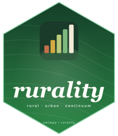

# rurality 

[](https://CRAN.R-project.org/package=rurality)

Rurality classification and scoring for U.S. counties and ZIP codes.

Provides USDA Rural-Urban Continuum Codes (RUCC 2023), Rural-Urban Commuting Area codes (RUCA 2020), and a composite rurality score for all 3,235 U.S. counties. Built to make rurality data easy to use in research without manually downloading and merging USDA spreadsheets.

**Web app:** [rurality.app](https://rurality.app)

## Install

```r
install.packages("rurality")
```

Or install the development version from GitHub:

```r
# install.packages("devtools")
devtools::install_github("cwimpy/rurality")
```

## Usage

```r
library(rurality)

# Look up a county by FIPS
get_rurality("05031")
#> Craighead County, AR — Score: 40 (Mixed), RUCC: 3

# Just the score
rurality_score("05031")
#> 40

# Just the RUCC code
get_rucc("05031")
#> 3

# RUCA code for a ZIP
get_ruca("72401")
#> Primary RUCA: 1 (Metropolitan core)

# Merge onto your own data
my_data <- data.frame(
  fips = c("05031", "06037", "48453"),
  outcome = c(0.7, 0.4, 0.6)
)
my_data |> add_rurality()

# Add all available variables
my_data |> add_rurality(vars = "all")
```

## Data

The package ships two datasets:

### `county_rurality`

All 3,235 U.S. counties with 24 variables including:

| Variable | Description |
|---|---|
| `fips` | 5-digit county FIPS code |
| `rurality_score` | Composite score (0-100) |
| `rurality_classification` | Urban, Suburban, Mixed, Rural, Very Rural |
| `rucc_2023` | USDA Rural-Urban Continuum Code (1-9) |
| `pop_density` | Population per square mile |
| `dist_large_metro` | Distance to nearest large metro (miles) |
| `median_income` | ACS 2022 median household income |
| `median_age` | ACS 2022 median age |

```r
# Browse the full dataset
county_rurality

# Filter to a state
county_rurality |> dplyr::filter(state_abbr == "AR")

# Distribution
table(county_rurality$rurality_classification)
#> Mixed    Rural Suburban    Urban Very Rural
#>   663      921      781       87        783
```

### `ruca_codes`

USDA RUCA codes (2020) for 41,146 ZIP code tabulation areas.

```r
ruca_codes |> dplyr::filter(state == "AR")
```

## Methodology

The composite rurality score is a weighted average of three components:

| Component | Weight | Source |
|---|---|---|
| RUCC score | 55% | USDA Economic Research Service, 2023 |
| Population density | 28% | Census ACS 2022 5-year estimates |
| Distance to metro | 17% | Haversine distance to nearest metro area |

Scores range from 0 (most urban) to 100 (most rural). See the [full methodology](https://rurality.app) for details.

## Citation

If you use this package in published research, please cite:

```
Wimpy, Cameron (2026). rurality: Rurality Classification and Scoring
  for U.S. Counties and ZIP Codes. R package version 0.1.0.
  https://github.com/cwimpy/rurality
```

## Data Sources

- [USDA ERS Rural-Urban Continuum Codes, 2023](https://www.ers.usda.gov/data-products/rural-urban-continuum-codes)
- [USDA ERS Rural-Urban Commuting Area Codes, 2020](https://www.ers.usda.gov/data-products/rural-urban-commuting-area-codes)
- [U.S. Census Bureau, American Community Survey 2022 5-Year Estimates](https://www.census.gov/programs-surveys/acs)
- [U.S. Census Bureau, TIGER/Line Shapefiles 2020](https://www.census.gov/geographies/mapping-files/time-series/geo/tiger-line-file.html)

## License

MIT
