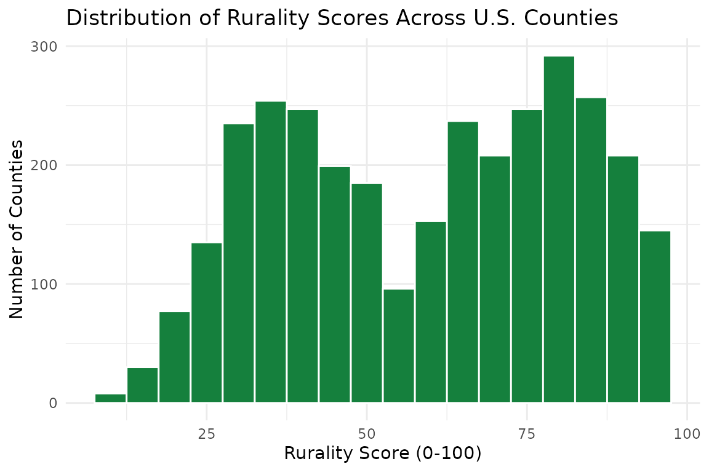

# Getting Started with rurality

## Overview

The `rurality` package provides rurality classification data for all
U.S. counties and ZIP codes. It bundles USDA Rural-Urban Continuum Codes
(RUCC 2023), Rural-Urban Commuting Area codes (RUCA 2020), and a
composite rurality score that combines multiple data sources into a
single 0–100 measure.

The package is designed for researchers who need to classify locations
by rurality without manually downloading and reshaping USDA
spreadsheets.

``` r
library(rurality)
library(dplyr)
#> 
#> Attaching package: 'dplyr'
#> The following objects are masked from 'package:stats':
#> 
#>     filter, lag
#> The following objects are masked from 'package:base':
#> 
#>     intersect, setdiff, setequal, union
```

## Looking up a county

The simplest use case is looking up rurality data for a county by its
5-digit FIPS code:

``` r
get_rurality("05031")
#> # A tibble: 1 × 24
#>   fips  state_fips county_fips state_abbr county_name      pop_2020 acs_pop
#>   <chr> <chr>      <chr>       <chr>      <chr>               <dbl>   <dbl>
#> 1 05031 05         031         AR         Craighead County   111231  111038
#> # ℹ 17 more variables: land_area_sqmi <dbl>, pop_density <dbl>,
#> #   rucc_2023 <int>, rucc_description <chr>, omb_designation <chr>, lat <dbl>,
#> #   lng <dbl>, dist_large_metro <dbl>, dist_medium_metro <dbl>,
#> #   dist_small_metro <dbl>, rucc_score <dbl>, density_score <dbl>,
#> #   distance_score <dbl>, rurality_score <dbl>, rurality_classification <chr>,
#> #   median_income <dbl>, median_age <dbl>
```

If you just need the score or the RUCC code:

``` r
rurality_score("05031")
#>  3 
#> 40
get_rucc("05031")
#> [1] 3
```

Multiple FIPS codes work too:

``` r
rurality_score(c("05031", "06037", "48453"))
#>  3  1  1 
#> 40 17 23
```

## Looking up a ZIP code

RUCA codes are available at the ZIP/ZCTA level:

``` r
get_ruca("72401")
#> # A tibble: 1 × 4
#>   zip   state primary_ruca secondary_ruca
#>   <chr> <chr>        <int>          <int>
#> 1 72401 AR               1              1
get_ruca(c("72401", "90210", "59801"))
#> # A tibble: 3 × 4
#>   zip   state primary_ruca secondary_ruca
#>   <chr> <chr>        <int>          <int>
#> 1 59801 MT               1              1
#> 2 72401 AR               1              1
#> 3 90210 CA               1              1
```

## Merging onto your data

The most common research workflow is merging rurality data onto an
existing dataset. The
[`add_rurality()`](https://cwimpy.github.io/rurality/reference/add_rurality.md)
function handles this:

``` r
my_data <- data.frame(
  fips = c("05031", "06037", "48453", "30063"),
  outcome = c(0.72, 0.41, 0.58, 0.89)
)

my_data |> add_rurality()
#>    fips outcome rurality_score rurality_classification rucc_2023
#> 1 05031    0.72             40                   Mixed         3
#> 2 06037    0.41             17                   Urban         1
#> 3 48453    0.58             23                Suburban         1
#> 4 30063    0.89             45                   Mixed         3
```

By default, three columns are added: `rurality_score`,
`rurality_classification`, and `rucc_2023`. Use `vars = "all"` for the
full set:

``` r
my_data |> add_rurality(vars = "all") |> glimpse()
#> Rows: 4
#> Columns: 25
#> $ fips                    <chr> "05031", "06037", "48453", "30063"
#> $ outcome                 <dbl> 0.72, 0.41, 0.58, 0.89
#> $ state_fips              <chr> "05", "06", "48", "30"
#> $ county_fips             <chr> "031", "037", "453", "063"
#> $ state_abbr              <chr> "AR", "CA", "TX", "MT"
#> $ county_name             <chr> "Craighead County", "Los Angeles County", "Tra…
#> $ pop_2020                <dbl> 111231, 10014009, 1290188, 117922
#> $ acs_pop                 <dbl> 111038, 9936690, 1289054, 118541
#> $ land_area_sqmi          <dbl> 707.1583, 4059.2816, 994.0526, 2593.0085
#> $ pop_density             <dbl> 157.0, 2447.9, 1296.8, 45.7
#> $ rucc_2023               <int> 3, 1, 1, 3
#> $ rucc_description        <chr> "Metro - Counties in metro areas of fewer than…
#> $ omb_designation         <chr> "Metropolitan", "Metropolitan", "Metropolitan"…
#> $ lat                     <dbl> 35.83091, 34.32080, 30.33436, 47.03601
#> $ lng                     <dbl> -90.63290, -118.22485, -97.78182, -113.92470
#> $ dist_large_metro        <dbl> 382.3440, 18.5902, 149.6074, 395.5553
#> $ dist_medium_metro       <dbl> 119.7631, 188.6871, 441.7468, 169.4502
#> $ dist_small_metro        <dbl> 4.076085, 377.962597, 558.870426, 11.787297
#> $ rucc_score              <dbl> 28, 8, 8, 28
#> $ density_score           <dbl> 45, 15, 22, 59
#> $ distance_score          <dbl> 69, 51, 75, 78
#> $ rurality_score          <dbl> 40, 17, 23, 45
#> $ rurality_classification <chr> "Mixed", "Urban", "Suburban", "Mixed"
#> $ median_income           <dbl> 55169, 83411, 92731, 66840
#> $ median_age              <dbl> 34.4, 37.4, 35.1, 36.7
```

If your FIPS column has a different name, specify it:

``` r
other_data <- data.frame(county_fips = c("05031", "06037"), y = 1:2)
other_data |> add_rurality(fips_col = "county_fips")
#>   county_fips y rurality_score rurality_classification rucc_2023
#> 1       05031 1             40                   Mixed         3
#> 2       06037 2             17                   Urban         1
```

## Classifying scores

The
[`classify_rurality()`](https://cwimpy.github.io/rurality/reference/classify_rurality.md)
function converts numeric scores to labels:

``` r
classify_rurality(c(10, 30, 50, 70, 90))
#> [1] "Urban"      "Suburban"   "Mixed"      "Rural"      "Very Rural"
```

The thresholds are:

| Score  | Classification |
|--------|----------------|
| 80–100 | Very Rural     |
| 60–79  | Rural          |
| 40–59  | Mixed          |
| 20–39  | Suburban       |
| 0–19   | Urban          |

## Browsing the full dataset

The `county_rurality` dataset contains all 3,235 U.S. counties:

``` r
county_rurality
#> # A tibble: 3,235 × 24
#>    fips  state_fips county_fips state_abbr county_name     pop_2020 acs_pop
#>    <chr> <chr>      <chr>       <chr>      <chr>              <dbl>   <dbl>
#>  1 01001 01         001         AL         Autauga County     58805   58761
#>  2 01003 01         003         AL         Baldwin County    231767  233420
#>  3 01005 01         005         AL         Barbour County     25223   24877
#>  4 01007 01         007         AL         Bibb County        22293   22251
#>  5 01009 01         009         AL         Blount County      59134   59077
#>  6 01011 01         011         AL         Bullock County     10357   10328
#>  7 01013 01         013         AL         Butler County      19051   18981
#>  8 01015 01         015         AL         Calhoun County    116441  116162
#>  9 01017 01         017         AL         Chambers County    34772   34612
#> 10 01019 01         019         AL         Cherokee County    24971   25069
#> # ℹ 3,225 more rows
#> # ℹ 17 more variables: land_area_sqmi <dbl>, pop_density <dbl>,
#> #   rucc_2023 <int>, rucc_description <chr>, omb_designation <chr>, lat <dbl>,
#> #   lng <dbl>, dist_large_metro <dbl>, dist_medium_metro <dbl>,
#> #   dist_small_metro <dbl>, rucc_score <dbl>, density_score <dbl>,
#> #   distance_score <dbl>, rurality_score <dbl>, rurality_classification <chr>,
#> #   median_income <dbl>, median_age <dbl>
```

Filter to a state:

``` r
county_rurality |>
  filter(state_abbr == "AR") |>
  select(county_name, rurality_score, rurality_classification, rucc_2023) |>
  arrange(desc(rurality_score)) |>
  head(10)
#> # A tibble: 10 × 4
#>    county_name    rurality_score rurality_classification rucc_2023
#>    <chr>                   <dbl> <chr>                       <int>
#>  1 Calhoun County             85 Very Rural                      9
#>  2 Chicot County              85 Very Rural                      9
#>  3 Newton County              85 Very Rural                      9
#>  4 Searcy County              85 Very Rural                      9
#>  5 Desha County               84 Very Rural                      9
#>  6 Fulton County              84 Very Rural                      9
#>  7 Monroe County              84 Very Rural                      9
#>  8 Clay County                83 Very Rural                      9
#>  9 Lincoln County             83 Very Rural                      9
#> 10 Marion County              83 Very Rural                      9
```

## Score distribution

``` r
if (requireNamespace("ggplot2", quietly = TRUE)) {
  ggplot2::ggplot(county_rurality, ggplot2::aes(x = rurality_score)) +
    ggplot2::geom_histogram(binwidth = 5, fill = "#15803d", color = "white") +
    ggplot2::labs(
      title = "Distribution of Rurality Scores Across U.S. Counties",
      x = "Rurality Score (0-100)",
      y = "Number of Counties"
    ) +
    ggplot2::theme_minimal()
}
#> Warning: Removed 22 rows containing non-finite outside the scale range
#> (`stat_bin()`).
```



## Methodology

The composite rurality score is a weighted average of three components:

| Component          | Weight | Source                                   |
|--------------------|--------|------------------------------------------|
| RUCC score         | 55%    | USDA Economic Research Service, 2023     |
| Population density | 28%    | Census ACS 2022 5-year estimates         |
| Distance to metro  | 17%    | Haversine distance to nearest metro area |

For full details, see [rurality.app](https://rurality.app).

## Citation

``` r
citation("rurality")
#> To cite package 'rurality' in publications use:
#> 
#>   Wimpy C (2026). _rurality: Rurality Classification and Scoring for
#>   U.S. Counties and ZIP Codes_. R package version 0.1.0,
#>   <https://rurality.app>.
#> 
#> A BibTeX entry for LaTeX users is
#> 
#>   @Manual{,
#>     title = {rurality: Rurality Classification and Scoring for U.S. Counties and ZIP Codes},
#>     author = {Cameron Wimpy},
#>     year = {2026},
#>     url = {https://rurality.app},
#>     note = {R package version 0.1.0},
#>   }
```
